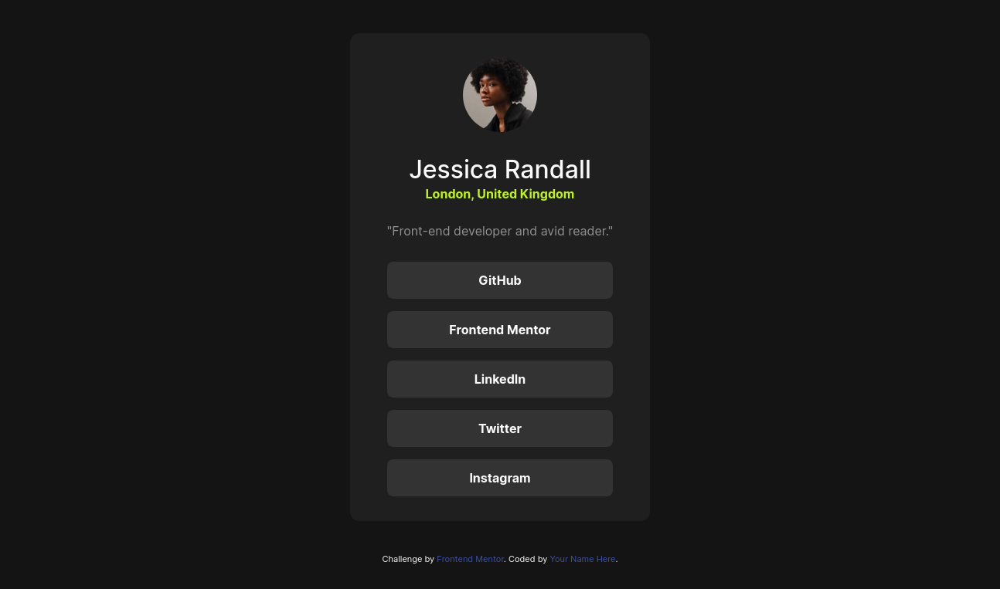

# Frontend Mentor - Social links profile solution

This is a solution to the [Social links profile challenge on Frontend Mentor](https://www.frontendmentor.io/challenges/social-links-profile-UG32l9m6dQ). Frontend Mentor challenges help you improve your coding skills by building realistic projects. 

## Table of contents

- [Overview](#overview)
  - [The challenge](#the-challenge)
  - [Screenshot](#screenshot)
  - [Links](#links)
- [My process](#my-process)
  - [Built with](#built-with)
  - [Continued development](#continued-development)
  - [Useful resources](#useful-resources)

**Note: Delete this note and update the table of contents based on what sections you keep.**

## Overview

### The challenge

Users should be able to:

- See hover and focus states for all interactive elements on the page

### Screenshot

### Links

- Solution URL: [Solution URL](https://github.com/cauanoli/challenge-social-links-profile)
- Live Site URL: [Live preview](https://cauanoli.github.io/challenge-social-links-profile/)

## My process

### Built with

- Semantic HTML5 markup
- CSS custom properties
- Flexbox

### Continued development

In future projects I want to focus on responsive web design using Grid and Flexbox. I also want to learn more new CSS features such as container queries.

### Useful resources

- [web.dev course on responsive design](https://web.dev/learn/design) - This course by web.dev on responsive design has been very helpful for me in learning how to make my projects work on all screens. It is a really great resource.
